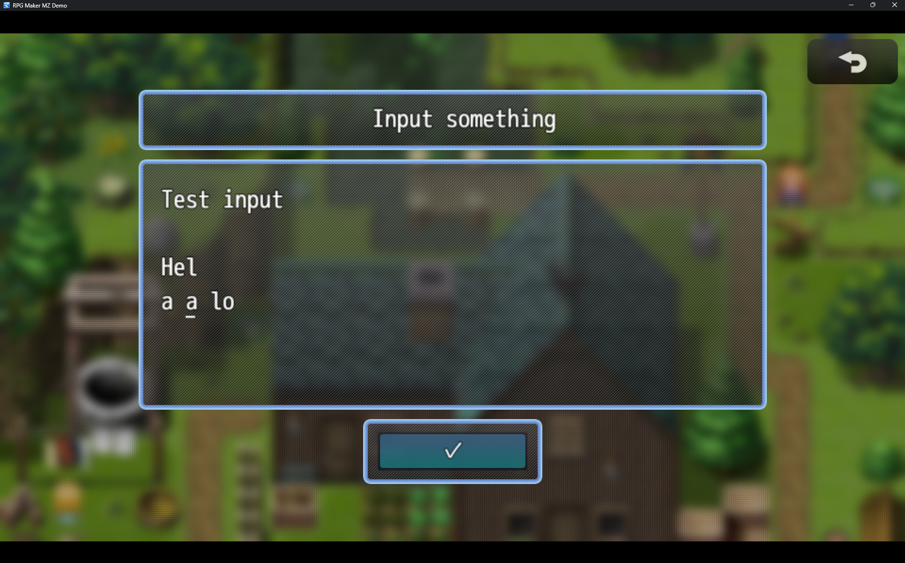
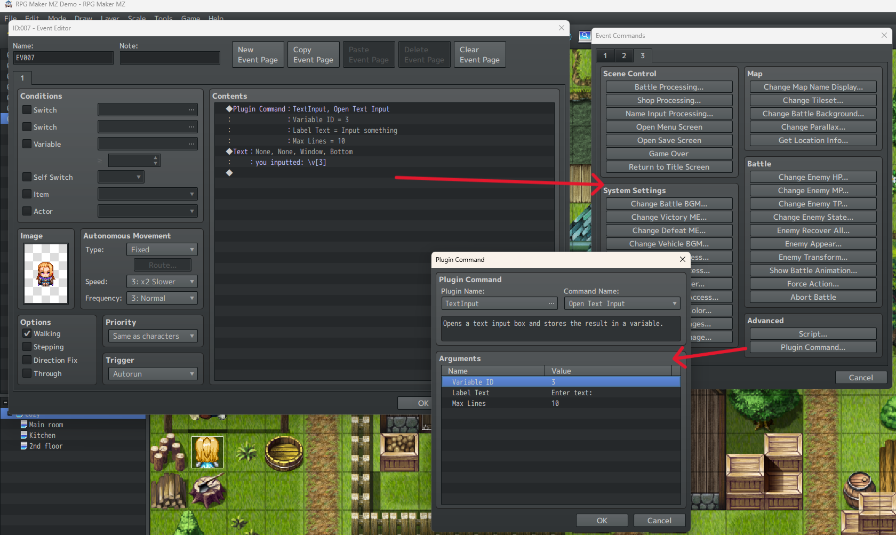

# RMMZ-TextInput

## A Text Input Plugin for RPG Maker MZ

A feature-rich multi-line text input system that works on both desktop and mobile devices.



## 🌟 Features

- 📝 Multi-line text input with customizable maximum lines
- 🏷️ Custom label text above the input field
- ✨ RPG Maker styled OK button for confirmation
- 📱 Mobile-friendly with proper keyboard support
- ⌨️ Full keyboard navigation support
- 🖱️ Mouse/touch cursor positioning
- 🔄 Automatic text wrapping
- 💾 Variable storage integration

## 📥 Installation

1. Download `TextInput.js`
2. Place it in your project's `js/plugins` folder
3. Enable the plugin in RPG Maker MZ's plugin manager

## 🔧 Configuration

### Plugin Parameters

| Parameter | Description | Default |
|-----------|-------------|---------|
| Input Width (%) | Width of the input box | 70 |
| Input Height (%) | Height of the input box | 50 |

### Plugin Commands

In your events, use the `OpenTextInput` plugin command:

```javascript
OpenTextInput
- Variable ID: [Game Variable to store text]
- Label Text: [Text shown above input]
- Max Lines: [Maximum lines allowed (1-100)]
```

## 📖 Usage Example

1. Create a new event
2. Add a "Plugin Command"
3. Select "Text Input" and "Open Text Input"
4. Configure parameters:
```javascript
Variable ID: 1
Label: "Enter your message:"
Max Lines: 5
```



## 🔍 Technical Details

- Hidden password-type input for optimal mobile keyboard handling
- Escaped character support
- Auto-scrolling for long text
- Efficient cursor management
- Touch/mouse position detection
- Mobile-friendly keyboard focus

## ⚡ Performance

The plugin uses optimized rendering and event handling to ensure smooth operation even with large amounts of text.

## 💻 Compatibility

- ✅ RPG Maker MZ v1.0.0+
- ✅ Desktop (Windows, MacOS, Linux) (should be anyways)
- ✅ Desktop browsers (Chrome, Firefox, Safari, Edge)
- ✅ Mobile browsers (iOS Safari, Android Chrome)
- ✅ Compatible with most other plugins

## 🤝 Contributing

Feel free to:
- Report bugs
- Suggest features
- Submit pull requests

## 📄 License

This project is licensed under the MIT License - see the [LICENSE](LICENSE) file for details.

## 🙏 Credits

Created by [Reishandy](https://github.com/Reishandy)
